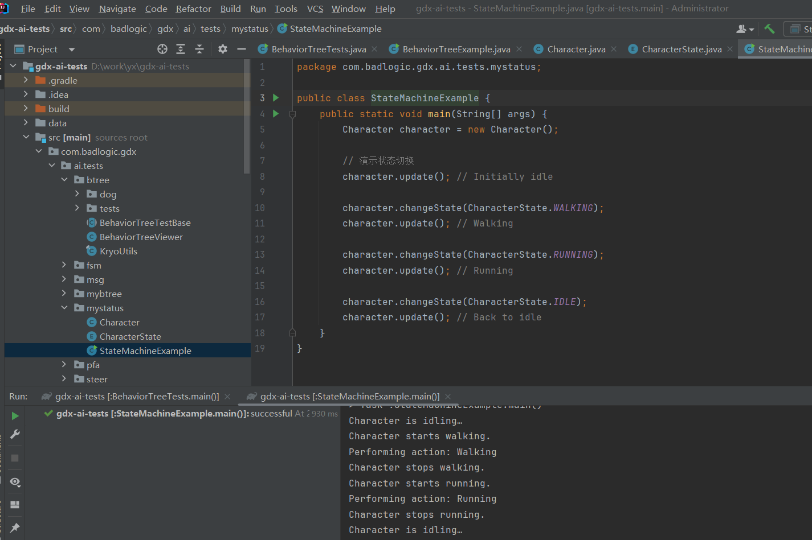

## 8.1 路径查找

​        在Libgdx中，您可以使用FileHandle类来查找和管理文件和目录。下面是一个如何使用FileHandle类在Libgdx项目的assets目录中查找文件的示例:

```
public class Game extends ApplicationAdapter {
    @Override
    public void create() {
        FileHandle file = Gdx.files.internal("data/example.txt");
        if (file.exists()) {
            String content = file.readString();
            System.out.println("File content: " + content);
        } else {
            System.out.println("File not found");
        }
    }
}
```

​        在这个例子中，Gdx.files.internal方法用于获取资产文件夹“data”目录下名为“example.txt”的文件的FileHandle。然后调用exists方法来检查文件是否存在，并调用readString方法来读取文件的内容。

如果需要查找目录，可以使用list方法获得目录中文件和目录的列表。这里有一个例子:

```
public class Game extends ApplicationAdapter {
    @Override
    public void create() {
        FileHandle dir = Gdx.files.internal("data");

        if (dir.isDirectory()) {
            FileHandle[] files = dir.list();

            for (FileHandle file : files) {
                System.out.println("File: " + file.name());
            }
        } else {
            System.out.println("Not a directory");
        }
    }
}
```

在本例中，使用Gdx.files.internal方法获取“data”目录的FileHandle。然后调用isDirectory方法来检查该目录是否存在，并调用list方法来获取该目录中的文件和目录的列表。调用name方法来获取每个文件的名称。

​        需要注意的是，FileHandle类提供了几种管理文件和目录的方法，包括复制、移动、删除和mkdirs。您可以使用这些方法执行各种文件操作，例如复制文件、移动文件、删除文件或创建目录。

下面是一个如何使用FileHandle类复制文件的例子:

```
public class Game extends ApplicationAdapter {
    @Override
    public void create() {
        FileHandle srcFile = Gdx.files.internal("data/example.txt");
        FileHandle destFile = Gdx.files.internal("data/example_copy.txt");

        if (srcFile.exists()) {
            srcFile.copyTo(destFile);
            System.out.println("File copied");
        } else {
            System.out.println("Source file not found");
        }
    }
}
```

​        在本例中，FileHandle类用于获取源文件和目标文件的FileHandle。调用exists方法检查源文件是否存在，调用copyTo方法将源文件复制到目标文件。println方法用于打印一条消息，表明文件是否复制成功。


在libGDX中，可以使用AStar类进行路径查找。以下是一个简单的示例：

```
import com.badlogic.gdx.math.Vector2;
import com.badlogic.gdx.utils.Array;
import com.badlogic.gdx.ai.pfa.DefaultConnection;
import com.badlogic.gdx.ai.pfa.PathFinderAdapter;
import com.badlogic.gdx.ai.pfa.indexed.IndexedAStarPathFinder;
import com.badlogic.gdx.ai.pfa.indexed.IndexedAStarPathFinder.Path;
import com.badlogic.gdx.maps.tiled.TiledMap;
import com.badlogic.gdx.maps.tiled.TiledMapTileLayer;

public class PathfindingExample {
    public static void main(String[] args) {
        // 加载地图
        TiledMap map = new TmxMapLoader().load("pathfinding_map.tmx");
        TiledMapTileLayer layer = (TiledMapTileLayer) map.getLayers().get(0);

        // 创建路径查找器
        PathFinderAdapter<Vector2> pathFinderAdapter = new TiledMapAdapter(layer);
        IndexedAStarPathFinder<Vector2> pathFinder = new IndexedAStarPathFinder<>(pathFinderAdapter, false);

        // 设置起点和终点
        Vector2 start = new Vector2(1, 1);
        Vector2 end = new Vector2(10, 10);

        // 查找路径
        Path<Vector2> path = pathFinder.findPath(start, end);
        System.out.println("找到的路径：" + path);
    }
}   
```

## 8.2 AI行为树（代码在mybtree包下）

准备工作

确保你已经将 gdx-ai 库添加到你的项目中。如果使用 Maven，可以在 `pom.xml` 中添加如下依赖：

```
 <dependency>
    <groupId>com.badlogicgames.gdx</groupId>
    <artifactId>gdx-ai</artifactId>
    <version>1.8.2</version>
</dependency>
```

示例代码

下面是完整的示例代码：

```
import com.badlogic.gdx.ai.btree.BehaviorTree;
import com.badlogic.gdx.ai.btree.LeafTask;
import com.badlogic.gdx.ai.btree.Task;
import com.badlogic.gdx.ai.btree.branch.Sequence;
import com.badlogic.gdx.ai.btree.decorator.Repeat;
import com.badlogic.gdx.ai.btree.leaf.Success;
import com.badlogic.gdx.ai.utils.random.ConstantIntegerDistribution;

// 定义角色类
class Character {
    public void sayHello() {
        System.out.println(“Hello! I am a character in this game.”);
    }
}

// 自定义任务实现
class PrintHelloTask extends LeafTask<Character> {
    @Override
    public Status execute() {
        Character character = getObject();
        character.sayHello();
        return Status.SUCCEEDED;
    }

    @Override
    protected Task<Character> copyTo(Task<Character> task) {
        return task;
    }
}

// 主类
public class BehaviorTreeExample {
    public static void main(String[] args) {
        Character character = new Character();
        BehaviorTree<Character> behaviorTree = new BehaviorTree<>(createBehaviorTreeStructure(), character);

        for (int i = 0; i < 10; i++) {
            behaviorTree.step();
        }
    }

    private static Task<Character> createBehaviorTreeStructure() {
        Sequence<Character> rootSequence = new Sequence<>();
        // 使用 ConstantIntegerDistribution 来指定重复次数
        rootSequence.addChild(new Repeat<>(new ConstantIntegerDistribution(1), new PrintHelloTask()));
        rootSequence.addChild(new Success<Character>());
        return rootSequence;
    }
}
```

代码详解

1. 定义角色类

`Character` 类是我们模拟的游戏角色，拥有一个简单的方法 `sayHello`，用于输出打招呼信息。

```
class Character {
    public void sayHello() {
        System.out.println(“Hello! I am a character in this game.”);
    }
}
```


2. 实现自定义任务

`PrintHelloTask` 是一个自定义的任务，继承自 `LeafTask<Character>`。它的主要逻辑是调用角色的 `sayHello` 方法。

```
class PrintHelloTask extends LeafTask<Character> {
    @Override
    public Status execute() {
        Character character = getObject();
        character.sayHello();
        return Status.SUCCEEDED;
    }

    @Override
    protected Task<Character> copyTo(Task<Character> task) {
        return task;
    }
}
```


3. 主类与行为树创建

在 `BehaviorTreeExample` 中，我们创建了一个角色实例，以及一个行为树实例，随后运行一个简单的循环来执行行为树的逻辑。

```
public class BehaviorTreeExample {
    public static void main(String[] args) {
        Character character = new Character();
        BehaviorTree<Character> behaviorTree = new BehaviorTree<>(createBehaviorTreeStructure(), character);

        for (int i = 0; i < 10; i++) {
            behaviorTree.step();
        }
    }

    private static Task<Character> createBehaviorTreeStructure() {
        Sequence<Character> rootSequence = new Sequence<>();
        // 使用 ConstantIntegerDistribution 来指定重复次数
        rootSequence.addChild(new Repeat<>(new ConstantIntegerDistribution(1), new PrintHelloTask()));
        rootSequence.addChild(new Success<Character>());
        return rootSequence;
    }
}
```


4. 行为树结构

在 `createBehaviorTreeStructure` 方法中，我们定义了行为树的结构。使用 `Sequence` 节点作为根节点，添加一个 `Repeat` 装饰器来控制 `PrintHelloTask` 的执行次数为 1 次。

```
private static Task<Character> createBehaviorTreeStructure() {
    Sequence<Character> rootSequence = new Sequence<>();
    rootSequence.addChild(new Repeat<>(new ConstantIntegerDistribution(1), new PrintHelloTask()));
    rootSequence.addChild(new Success<Character>());
    return rootSequence;
}
```

运行结果：


## 8.3 状态机，完整代码（代码在mystatus包下）

LibGDX 的 gdx-ai 库支持有限状态机（Finite State Machine, FSM）来管理对象的状态转换，这在游戏开发中广泛用于管理角色行为状态。下面是一个简单的 Java 示例，展示如何使用 gdx-ai 实现状态机并进行演示。

准备工作

确保你已经将 gdx-ai 库添加到你的项目中。如果使用 Maven，可以在 `pom.xml` 中添加如下依赖：

```
<dependency>
    <groupId>com.badlogicgames.gdx</groupId>
    <artifactId>gdx-ai</artifactId>
    <version>1.8.2</version>
</dependency>
```

示例代码

以下是一个完整的实现状态机的 Java 示例代码：

```
import com.badlogic.gdx.ai.fsm.State;
import com.badlogic.gdx.ai.fsm.StateMachine;
import com.badlogic.gdx.ai.fsm.DefaultStateMachine;
import com.badlogic.gdx.ai.msg.Telegram;

class Character {
    private StateMachine<Character, CharacterState> stateMachine;

    public Character() {
        stateMachine = new DefaultStateMachine<>(this, CharacterState.IDLE);
    }

    public void update() {
        stateMachine.update();
    }

    public void changeState(CharacterState newState) {
        stateMachine.changeState(newState);
    }

    public StateMachine<Character, CharacterState> getStateMachine() {
        return stateMachine;
    }

    public void performAction(String action) {
        System.out.println("Performing action: " + action);
    }
}

enum CharacterState implements State<Character> {
    IDLE {
        @Override
        public void update(Character character) {
            System.out.println(“Character is idling…”);
        }
    },
    WALKING {
        @Override
        public void enter(Character character) {
            System.out.println(“Character starts walking.”);
        }

        @Override
        public void update(Character character) {
            character.performAction(“Walking”);
        }

        @Override
        public void exit(Character character) {
            System.out.println(“Character stops walking.”);
        }
    },
    RUNNING {
        @Override
        public void enter(Character character) {
            System.out.println(“Character starts running.”);
        }

        @Override
        public void update(Character character) {
            character.performAction(“Running”);
        }

        @Override
        public void exit(Character character) {
            System.out.println(“Character stops running.”);
        }
    };

    @Override
    public void enter(Character entity) {
    }

    @Override
    public void update(Character entity) {
    }

    @Override
    public void exit(Character entity) {
    }

    @Override
    public boolean onMessage(Character entity, Telegram telegram) {
        return false;
    }
}

public class StateMachineExample {
    public static void main(String[] args) {
        Character character = new Character();

        // 演示状态切换
        character.update(); // Initially idle

        character.changeState(CharacterState.WALKING);
        character.update(); // Walking

        character.changeState(CharacterState.RUNNING);
        character.update(); // Running

        character.changeState(CharacterState.IDLE);
        character.update(); // Back to idle
    }
}
```

 代码解析

\- **Character 类**: 角色类主要管理状态机并调用其更新和状态切换方法。

\- **CharacterState 枚举**: 定义了角色的所有可能状态，包括 `IDLE`、`WALKING` 和 `RUNNING`，每个状态都实现了 `State` 接口，通过 `enter`、`update` 和 `exit` 方法来管理状态特定的行为和打印信息。

\- **StateMachineExample 类**: 主类演示状态机的使用，通过角色实例管理状态并触发变化。

 执行机制

1. **初始化状态**：在 `Character` 的构造函数中初始化状态机，初始状态为 `IDLE`。

2. **状态更新**：在 `update()` 方法中调用当前状态的 `update` 行为。

3. **状态切换**：通过 `changeState()` 方法切换角色的当前状态。

运行结果：


